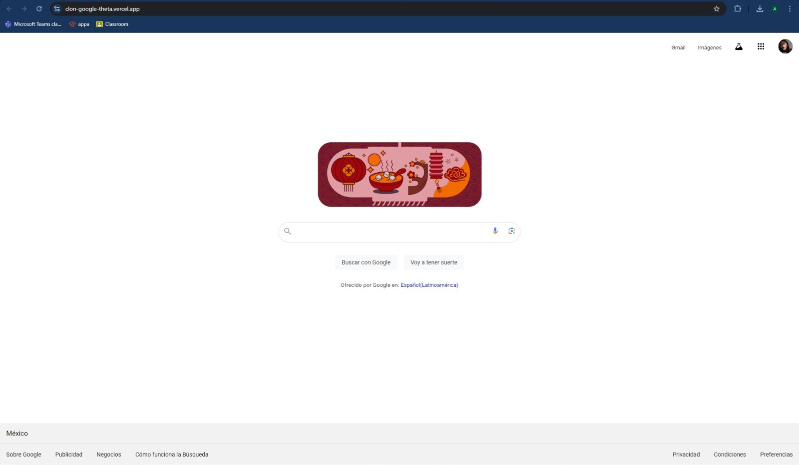

# Clon de Google en Technolochicas Pro

El presente proyecto es un clon de Google desarrollado para poner en práctica las habilidades obtenidad dentro del bootcamp de desarrollo frontend de Techno lochicas PRO.

Fue desarrollado con HTML y CSS.

La página es responsiva (adaptable a diferentes tamaños de pantalla) e incluye la presentación de la autora del proyecto.

[Proyecto Desplegado (https://clon-google-theta.vercel.app/)](https://clon-google-theta.vercel.app/)

## Secciones de mi sitio

## Tecnologías

* HTML
* CSS

---

Desarrollado con <3 por Andrea López en [Technolochicas Pro.](https://tecnolochicas.mx/)
